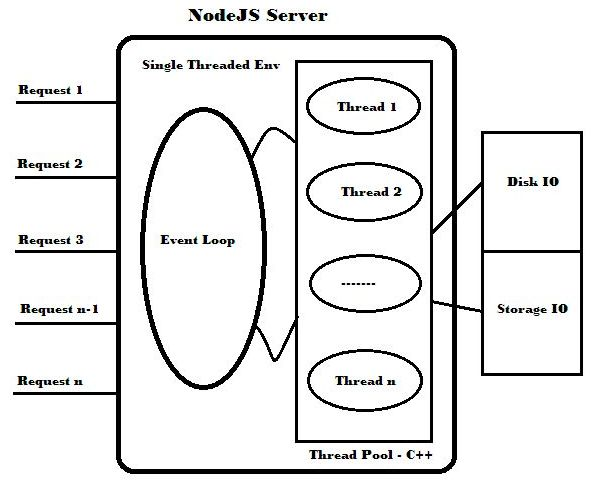

# Event/Async

## Q1：Node.js 中定时功能的顺序是怎样的？

Node.js 的定时器模块提供了在一段时间之后执行一些函数的功能。

- **setTimeout/clearTimeout** - 用于在指定的毫秒数后执行代码块（仅执行一次）

- **setInterval/clearInterval** - 用于在指定的毫秒数后循环执行代码块（循环执行）

- **setImmediate/clearImmediate** - 在当前事件循环周期结束后执行代码块

- **process.nextTick** - 在当前执行栈尾部，Event-Loop 之前触发

**timer 的执行顺序**

```
process.nextTick > setImmidate > setTimeout / SetInterval
```

**示例**

```js
function cb(msg){
    return function() {
        console.log(msg);
    }
}

setTimeout(cb('setTimeout'), 1000);
setImmediate(cb('setImmediate'))
process.nextTick(cb('process.nextTick'));
cb('Main process')();
```

Output:

```bash
Main process
process.nextTick
setImmediate
setTimeout
```

Source: [https://dev.to/aershov24/7-hardest-nodejs-interview-questions--answers-3lje](https://dev.to/aershov24/7-hardest-nodejs-interview-questions--answers-3lje)

## Q2：process.nextTick 与 setTimeout 递归调用区别？

> process.nextTick 属于微任务，是在当前执行栈的尾部，Event Loop 之前触发，下面两个都是递归调用，test1 中 process.nextTick 是在当前执行栈调用，是一次性执行完，相当于 while(true){}，主线程陷入了死循环，阻断 IO 操作。

> test2 方法中，setTimeout 属于宏任务，在任务队列中同样也是递归，但是它并不是一次性的执行而是会多次 Event Loop，不会阻断 IO 操作，另外注意 setTimeout 有一个最小的时间 4ms。

```javascript
function test1() {
    process.nextTick(() => test());
}

function test2() {
    setTimeout(() => test(), 0);
}
```

process.nextTick 将会阻塞 IO，setImmediate 不会输出

```js
function test() {
    return process.nextTick(() => test());
}

test();

setImmediate(() => {
    console.log('setImmediate');
})
```

下面使用 setTimeout 不会造成 IO 阻塞，会输出 setImmediate

```js
function test() { 
    setTimeout(() => test(), 0);
}

test()

setImmediate(() => {
    console.log('setImmediate');
})

// setImmediate
```

## Q3：解释下 JavaScript 中的 EventLoop（事件循环）？

众所周知，JavaScript 是单线程的，当发起一个请求时会通过回调函数来接收后续的事件响应，不会造成阻塞，继续接收下一次请求操作。


1. 当触发一个事件时，相应的这个事件会进入到一个 EventLoop 队列中
2. 检查 EventLoop 中是否存在事件消息，如果消息存在则会触发相应的回调
3. 处理完成回调中的操作，就会返回到步骤 2 进行下一次 EventLoop

注意：如果 JavaScript 运行时同其它的事件消息一起被使用，则其它的事件消息必须等到当前消息处理完成。当时在浏览器上预览时一些东西时，有时你可能会看到 “浏览器没有响应”，这是因为有太耗时的事件消息，因此，尽可能的保证你的事件消息不要太耗时。

例如：

```js
var msg = document.getElementById("msg");  
    msg.addEventListener("click", function () {  
    this.style.color = "blue";  
});  
```

在上面例子中我们单击 msg 元素，将会触发一次事件消息，该事件消息会入一个“事件队列”中。

如果此时事件队列中有消息，则会等待其它的消息完成之后，在去处理我们的 msg 事件消息并将完成结果渲染到 DOM 中。

## Q4: 解释下 NodeJS 中的 EventLoop（事件循环）？

* 当收到一个请求时，它将使用一个 JavaScript 闭包排队进入 EventLoop，该闭包包括这个事件（请求和相应）和相应的回调。

* 如果这个工作需要很长时间才能完成，将会分配一个工作线程给予这个事件来处理，这个工作线程来自 C++ 线程池，由 Libuv 库处理。

* 一旦这个工作完成，将会触发相应的回调将响应结果返回给主线程

* Event Loop 将响应返回给客户端

下图展示了 Node.js EventLoop 的体系结构



例如:

```js
var fs = require('fs');  
fs.readFile('avator.png', function(avator) {  
    console.log(‘image is loaded…’);  
});  
fs.writeFile('log.txt', 'Done', function() {  
    console.log(‘Done !..’);  
});  
```

执行流程如下所示：

* 以上我们的代码会告诉这个节点有两个任务 read() and write() 需要执行，之后会休息以下。

* read() and write() 这两个操作将会进入 Event Loop 事件队列并将这个 job 分发到工作线程。

* 一旦工作线程完成这个 job，它将触发回调返回响应到 Event Loop。

* 之后 Event Loop 返回响应到客户端.

将会按照第一个先完成这样顺序执行  read() and write() 的回调。但是请注意，一次仅能执行一个回调，所以在 Node.js 环境中不会出现死锁和资源竞争的问题。因此，它可以确保 Node.js 能够提供非阻塞 I/O 模型。

对这个 Node.js Event Loop 的理解我们举一个邮局场景说明。

当我们想要发布或请求一些事情时，这个邮政领导可以要求邮递员发送邮件到相应的地址。

一旦这个邮递员完成邮件投递，他们将会一个一个（这里想要表明是顺序的）向邮政领导报告邮件已经完成。

如果这个邮递员在有时间的情况下，邮政领导也可以派发一些工作给他。

Source: [Introduction to NodeJS, A SSJS: Part II - EventLoop Explained](https://www.c-sharpcorner.com/article/node-js-interview-questions-and-answers/)

## Q5：什么是 Event Loop 和 Event Emitter ?

**Event Loop**
Node.js 虽是单线程应用程序，但是其基于 events and callbacks 机制，可以很好的完成并发操作。Node thread 会保持一个 EventLoop（事件循环）当任何任务完成时该节点都会触发相应的回调。

**Event Emitter**
每当完成任何任务、发生任何错误、添加一个 listener 或删除一个 listener 时，EventEmitter 都会触发一个事件。它提供了 on 和 emit 等属性，on 用于绑定函数，emit 用于触发事件。

Source: [top-20-interview-questions-on-nodejs](https://www.codingdefined.com/2017/04/top-20-interview-questions-on-nodejs.html)
