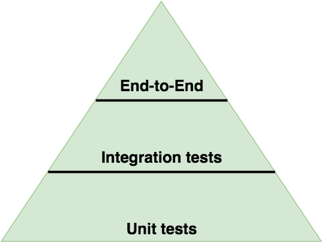

# 测试

## Q1: 什么是测试金字塔? 请给一个例子!

测试金字塔描述了你应该编写的单元测试、集成测试和端到端测试所占用的比例。



一个测试 HTTP API 的示例，如下所示：

* 金字塔的最底端所展示的有很多单元测试，用于分别测试各个模块（依赖项是 stub）。

* 较少的集成测试，可以让你检查各模块之间的交互 (依赖项不是 stub)。
* 更少的端到端测试，去调用你的实际接口（依赖项不是 stub）。

## Q2: 什么是 Stub？用一个例子说明

Stubs 是模拟组件或模块的行为。在一个测试用例期间 Stub 可以用来模拟函数调用的返回值，还可以配合断言来使用。

例如，我们有一个读取文件的程序，在做测试时我们并不需要真正的去读，可以通过 Stub 进行模式。示例如下：

```js
var fs = require('fs');

var readFileStub = sinon.stub(fs, 'readFile', function (path, cb) {
  return cb(null, 'filecontent');
});

expect(readFileStub).to.be.called;
readFileStub.restore();
```